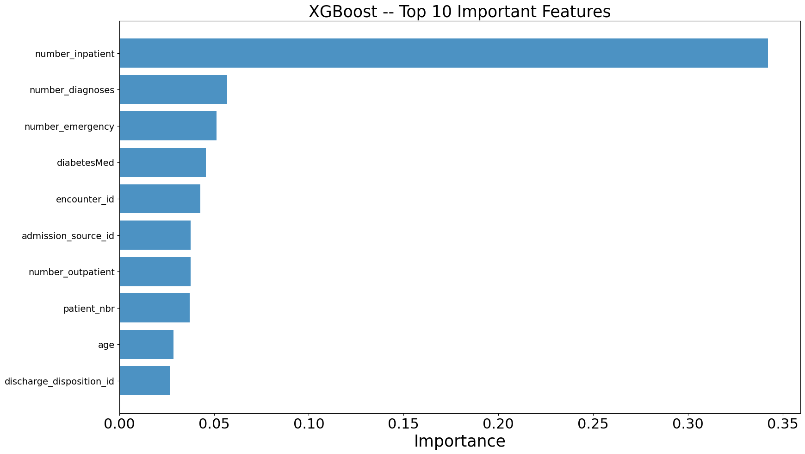

# <h1 align=center> **Prediction of hospital readmission in patients with diabetes** </h1>

This repository contains a Dockerized analysis pipeline for clustering wine data retrieved via an API call using Flask.

## Before project
- [User Stories](https://docs.google.com/document/d/1_BqFKL66q6OwGESEL9LdnIFtoJ4ZN1XUMGONl5F3J0w/edit?usp=sharing)
- [MVP](https://docs.google.com/document/d/10j4t7Dm43bZ5p5VO0pc2pdTAf__GpJXO013awTWhf14/edit?usp=sharing)

## Overview
- Data Description
- Data analysis and models testting comparisons
- Usage
- Endpoints
- Files
- Dependencies
- Credits

## Description of Dataset
The raw data set Diabetes 130-US hospitals for years 1999-2008 Data Set can be found [here](https://archive.ics.uci.edu/ml/datasets/Diabetes+130-US+hospitals+for+years+1999-2008#). The data set represents 10 years (1999-2008) of clinical care across 130 U.S. hospitals and integrated delivery networks. It includes more than 50 features representing patient and hospital outcomes. Information was extracted from the database for encounters that met the following criteria.

(1) It is a hospital encounter (a hospital admission).

(2) It is a diabetic encounter, that is, one during which any type of diabetes was entered into the system as a diagnosis.

(3) The length of stay was at least 1 day and at most 14 days.

(4) Laboratory tests were performed during the meeting.

(5) Medications were administered during the encounter. The data contains attributes such as patient number, race, sex, age, type of admission, time in hospital, medical specialty of the admitting physician, number of laboratory tests performed, HbA1c test result, diagnosis, number of medications , diabetes medications, number of outpatients. , hospitalization and emergency visits in the year before hospitalization, etc.

### Data analysis and models testting comparisons

Inside the notebook folder you will find the file notebook.ipynb where the data analysis, cleaning, insights are recorded, as well as the model tests (linear regression, decision tree and SMV) used to find the best prediction, the comparison between them and the choice of the best one for the task.

We obtained the best result with the XGBoot model with optimized parameters. 
Optimized Model:
Accuracy:  0.6709327007116993
F1 Score:  0.6695352892591817



### Usage

Follow the instructions below to run the analysis pipeline:

1. **Clone the Repository**:

    ```bash
    git clone c16-110-n-data-bi
    ```

2. **Build the Docker Image**:

    ```bash
    docker build -t app-readmission .
    ```

3. **Run the Docker Container**:

    ```bash
    docker run -p 5000:5000 app-readmission
    ```

### Endpoints

1. **Access Data**:

    To access raw DataFrame, copy on your browser:
    ```bash
    127.0.0.1:5000/diabetes-data
    ```

2. **Access Prediction Result**:

    To access DataFrame with the type of wine identified, copy on your browser:
    ```bash
    127.0.0.1:5000/prediction/{input}
    ```


### Files

- `notebooks`: Contains notebooks with the data analysis and ML model.
- `templates`: Contains HTML template for the endpoints.
- `Dockerfile`: Contains instructions for building the Docker image.
- `requirements.txt`: Lists the dependencies required for the analysis.
- `app.py`: Flask API for serving the diabetes dataset.
- `README.md`: Instructions for running the analysis pipeline.

### Dependencies

- Flask
- Numpy
- Pandas 
- Matplotlib
- Seaborn
- Scikit-learn
- Pyarrow
- Optuna
- Xgboost

### Credits

- This analysis pipeline was created by: Luciana Agustina Bolo ([LinkedIn](https://www.linkedin.com/in/agustina-bolo/)), Moreira Rodrigo ([LinkedIn](https://www.linkedin.com/in/rcmoreg/)) and Ezequiel Mazzini([LinkedIn](https://www.linkedin.com/in/ezequiel-mazzini/)).
